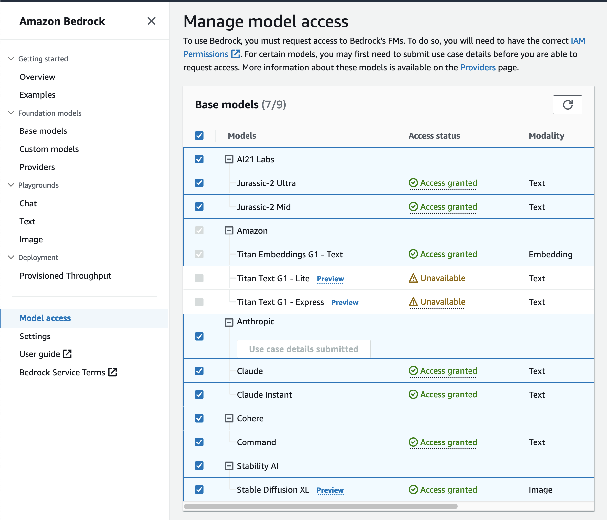
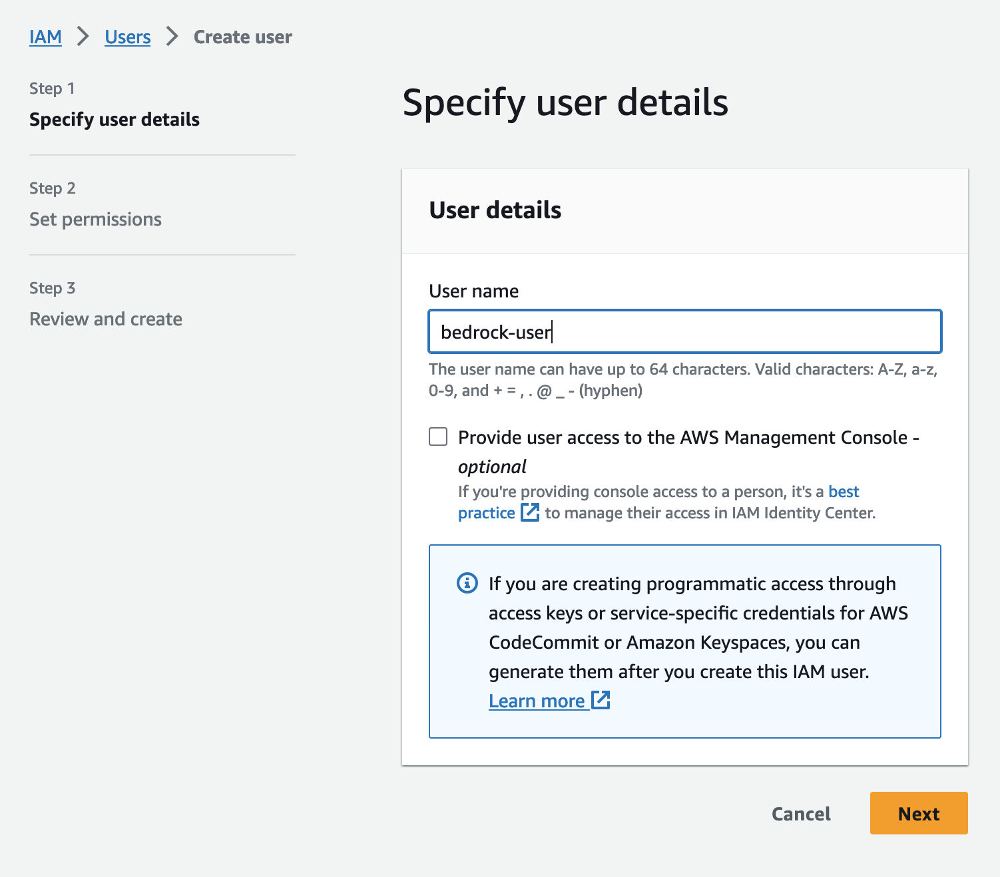
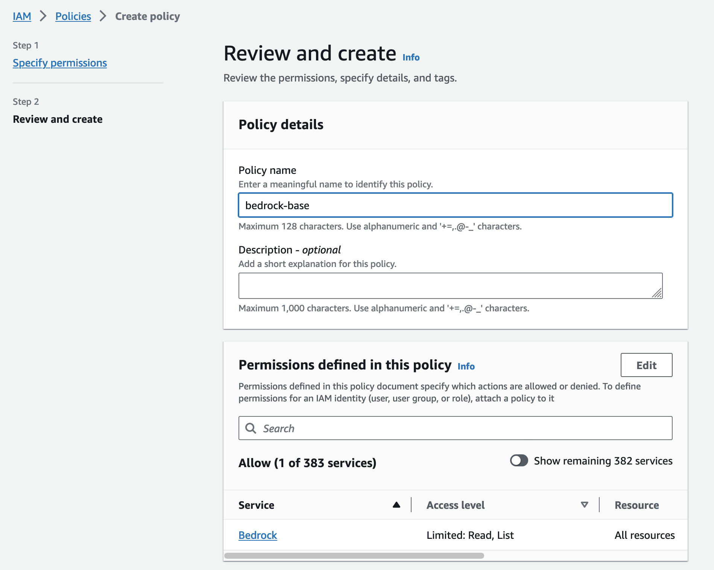
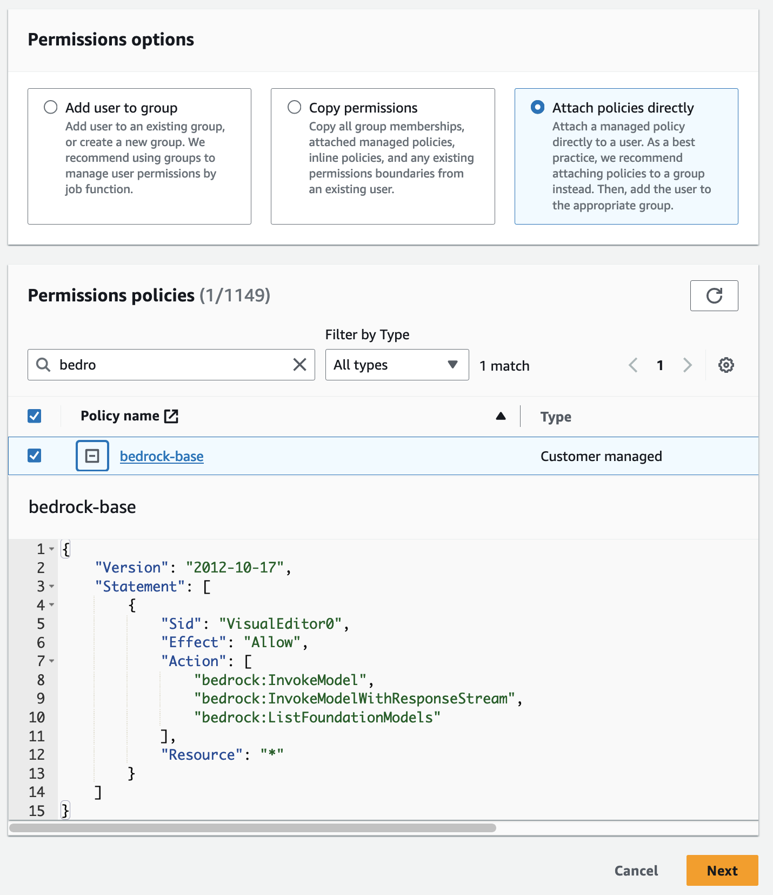
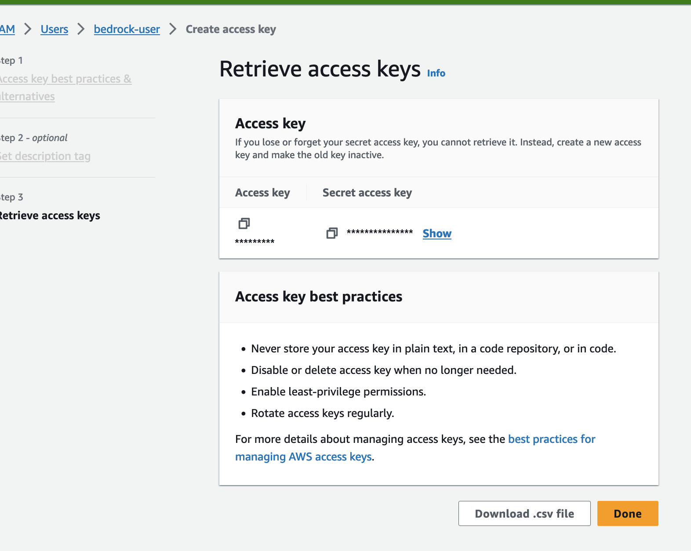

# Prerequisitos


## Habilitar el acceso a modelos en la consola Bedrock

Ve a la [consola de Bedrock](https://us-east-1.console.aws.amazon.com/bedrock/home?region=us-east-1#/modelaccess) y en la sección de model access activa los modelos base

Esto permite invocar los modelos más adelante.

Nota: Para el caso den Anthropic deben indicar un caso de uso como encuesta antes de habilitar.




## Instalar AWS Cli

Para instalar AWS CLI, siga las [instrucciones para su sistema operativo](https://docs.aws.amazon.com/cli/latest/userguide/getting-started-install.html) en la Guía del usuario de AWS Command Line Interface.


## Crear un usuario de AWS con permisos para invocar Bedrock

Crear un usuario IAM con permisos Bedrock
1. Inicia sesión en la consola de AWS IAM y selecciona "Usuarios" en el panel de navegación izquierdo.
2. Haz clic en "Agregar usuario".
3. Asigna un nombre descriptivo al usuario (ej. usuario-bedrock). No es necesario el acceso de consola,  y haz clic en "Siguiente"



5. click en "Agregar politicas directamente" y luego "Crear politica" con los siguientes permisos:
    - Servicio: Bedrock
    - Acciones: 
        - InvokeModel
        - InvokeModelWithResponseStream
        - ListFoundationModels
    - recursos: * 




3. Vuelve a continuar la creación el usuario y agrega la politica nuevamente creada. Luego Next




Esto crea un usuario IAM con permiso para invocar cualquier acción de las indicadas.

4. Obtiene las credenciales programaticas 
    - ve al usuario en IAM y selecciona Create Access Keys 
    - Seleccionar CLI y marcar "I understand the above recommendation and want to proceed to create an access key."
    - Toma nota de access key y secret access key (descarga archivo csv)




## Crea un perfil de AWS en tu máquina

Despues de instalar aws cli ejecuta:

```zsh
aws configure
```

Proporciona el access key id , y secret access key y la región predeterminada cuando se le solicite. Esto creará un perfil predeterminado (predeterminado) en tu archivo ~/.aws/credentials.


### Verifica que todo esté correcto ejecutando 


```zsh
aws bedrock list-foundation-models
```

salida:
```zsh
{
    "modelSummaries": [
        {
            "modelArn":...
            ....
        ...
        }
    ]
}
    
```


## Python 3

Python 3 necesita estar instalado en la máquina local para ejecutar scripts de Python e interactuar con los servicios de AWS utilizando la biblioteca AWS SDK y Boto3. Descarga e instala la versión más reciente de Python de python.org.


