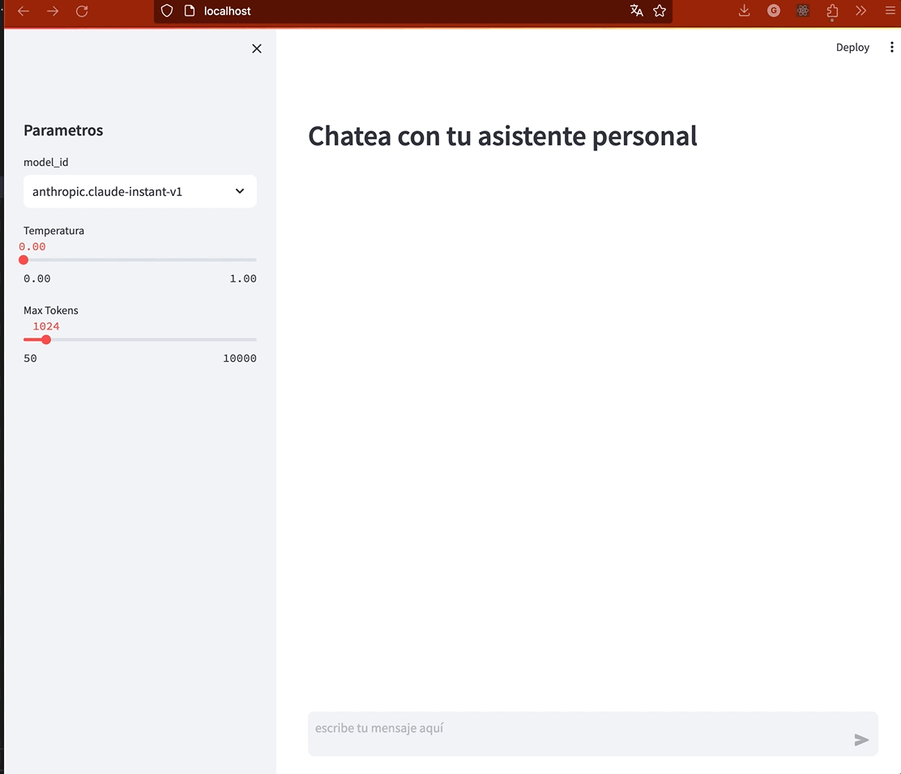
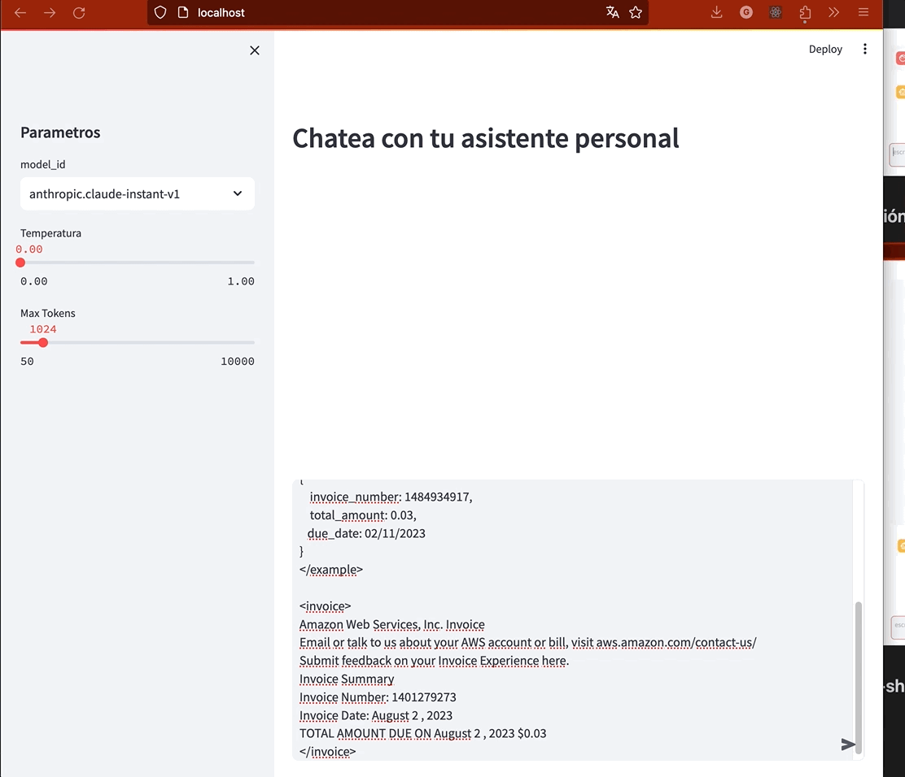
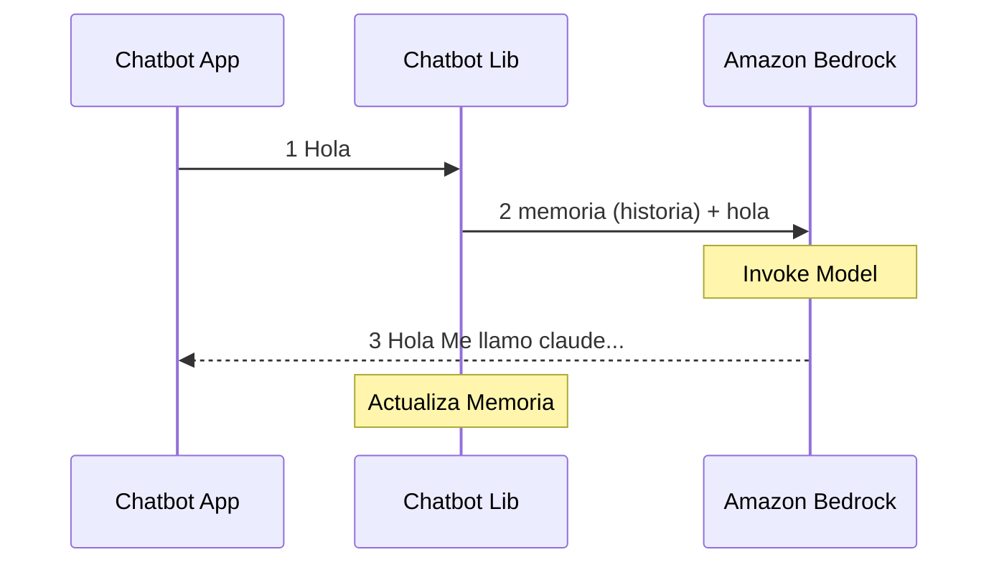

# Asistente Personal usando Generative AI

## Indice

1. [Intro](#introducción)
2. [Pre requisitos](#pre-requisitos)
3. [Lanzar la Aplicación](#instrucciones-para-lanzar-la-aplicación)
4. [Uso de la Aplicación](#uso-del-asistente)
    * [Generación de Código](#generacion-de-código)
    * [Resumen y extracción de informacion](#resumen-y-extracción-de-información-relevante)
    * [Experimenta con 1-shot learning](#experimenta-con-1-shot-learning)
4. [Cómo Funciona?](#cómo-funciona)
4. [Acerca de los Large Language Models](#acerca-del-llm-aka-large-language-model)
    * [Amazon Bedrock y Anthropic Claude](#amazon-bedrock-y-anthropic-claude)
    * [Memoria](#memoria)
4. [Costo](#costo)
4. [Que son los tokens y como se calculan?](#qué-son-y-como-se-estiman-los-tokens)
5. [Conclusiones y siguientes pasos](#conclusiones-y-siguientes-pasos)


## Introducción

En este blog sobre cómo crear un Asistente Personal usando IA Generativa (primero de la serie, espero) les compartiré los pasos necesarios para lanzar su propio chatbot en un entorno local y aprovechar esta nueva technología para ayudarte en tus labores diarias forma segura y privada. Si quieres saber acerca del código que está detrás puedes ir directo a la sección [Cómo funciona](#cómo-funciona).


La IA generativa ha revolucionado el mundo porque hemos podido, a través de aplicaciones de consumo como ChatGPT, experimentar lo poderosos que se han vuelto los últimos modelos de aprendizaje automático. Si bien se ha prestado mucha atención a cómo los consumidores están usando la IA generativa, creemos que hay una oportunidad aún mayor en cómo personas y startups pueden crear servicios similares y como las empresas los utilizan para mejorar su operación.

Veremos cómo funciona el código detrás de escenas, que invoca modelos de lenguage gigantes (large language models, LLM) por [Amazon Bedrock](https://aws.amazon.com/es/bedrock/) y [Anthropic Claude](https://aws.amazon.com/es/bedrock/claude/) para generar respuestas conversacionales. Aprenderemos conceptos clave como prompts, memoria de conversación y streaming callbacks (y algo de [streamlit](https://docs.streamlit.io/knowledge-base/tutorials))

Experimentaremos con distintas tareas como generación de código, resumen de textos y one-shot learning. Al final, entenderás los componentes principales de un sistema de chatbot: la interfaz de usuario, la lógica de backend y la integración con modelos de lenguaje de gran escala.


## Pre requisitos:

[Aca puedes encontrar los pre requisitos](prerequisites.md) asegura de poder ejecutar `aws bedrock list-foundation-models` usando **aws cli** antes de comenzar.

## Instrucciones para lanzar la aplicación

### Clonar repositorio

Clona este repositorio y accede a la carpeta:

```zsh
git clone https://github.com/ensamblador/generative-ai-chat-application.git
cd generative-ai-chat-application/01-personal-assistant
```

### Configuración del entorno virtual

1. Crea un entorno virtual:

    ```zsh
    python3 -m venv .venv
    ```

2. Activa el entorno virtual:

    ```zsh
    source .venv/bin/activate
    ```

### Instalación de dependencias

Instala las dependencias del proyecto:

```zsh
pip install -r requirements.txt
```

### Lanzar la aplicación

Inicia la aplicación del asistente:

```zsh
streamlit run chatbot_app.py --server.port 80
```

La aplicación estará disponible en http://localhost:80

## Uso del asistente

Comencemos por probar distintas tareas

### Generacion de código

Prompt:

```markdown
necesito un codigo para levantar un chatbot usando streamlit en localhost
```




### Resumen y extracción de información relevante

Prompt:

```markdown
Ayudame resumiento en 5 ideas lo siguiente:
<Tiktok Terms of services>
```


Follow up:
```markdown
Soy dueño de mis datos?
```


### Experimenta con 1-shot learning:

Por ejemplo, el prompt siguiente tiene 1 ejemplo (1-shot):

```markdown
Extract invoice number, total amount and due date (output as json) from the text enclosed by <invoice> tags. Here is an example:
<example> Amazon Web Services, Inc. Invoice Email or talk to us about your AWS account or bill, visit aws.amazon.com/contact-us/ Submit feedback on your Invoice Experience here. Invoice Summary Invoice Number: 1484934918 Invoice Date: November 2 , 2023 TOTAL AMOUNT DUE ON November 2 , 2023 $0.03

{ 
    invoice_number: 1484934918, 
    total_amount: 0.03, 
    due_date: 02/11/2023 
} 

</example>
<invoice> 
Amazon Web Services, Inc. Invoice Email or talk to us about your AWS account or bill, visit aws.amazon.com/contact-us/ Submit feedback on your Invoice Experience here. Invoice Summary Invoice Number: 1401279274 Invoice Date: August 2 , 2023 TOTAL AMOUNT DUE ON August 2 , 2023 $0.03 
</invoice>
```




output:

```markdown
Here is the JSON extracted from the invoice tags:

{ 
    "invoice_number": 1401279274, 
    "total_amount": 0.03, 
    "due_date": "02/08/2023" 
}
```


## Cómo funciona?

La aplicacion se construye usando dos script python `chatbot_app.py` (interfaz de usuario) y `chatbot_lib.py` (backend). A continuación vemos la secuencia de invocación:

1. El usuario envia un mensaje en cuadro de texto de de streamlit `chatbot_app.py`

    ```python
    input_text = st.chat_input("escribe tu mensaje aquí")
    ```

    `chatbot_app.py` invoca la funcion de `chatbot_lib.py` para obtener la respuesta (completación) del input

    ```python
    with chat_message: 
        chat_response = glib.get_chat_response( # definido en chatbot_lib.py
            prompt=input_text, # texto ingresado por el usuario
            memory=st.session_state.memory, # memoria actual de la conversación
            streaming_callback=st_callback, # funcion a invocar cuando se genere la respuesta progresiva
            model_id= model_id, # id del modelo LLM a invocar
            invocation_kwargs = { # keyworkd args para sobre escribir en la invocación
                "max_tokens_to_sample": max_tokens, # cantidad máxima de tokens generados
                "temperature":temp # temperatura (nivel de libertad o creatividad en la generación)
            }
        )
    ```



2. `chatbot_lib.py` invoca Amazon Bedrock con el `model_id` definido por la app:


    ```python 
    def get_chat_response(prompt, memory, streaming_callback=None,invocation_kwargs=None, model_id= None):
        
        llm = get_llm(streaming_callback, invocation_kwargs, model_id) 
        
        conversation_with_summary = ConversationChain( #cliente chat con memoria
            llm = llm, #instancia de un LLM en Bedrock
            memory = memory, # memoria con resumen
            verbose = True # envia algunos logs a la salida
        )
        # Nuevo template del prompt, a customizar.
        conversation_with_summary.prompt.template ="""The following is a friendly conversation between a human and an AI. 
        The AI is talkative and provides lots of specific details from its context. 
        If the AI does not know the answer to a question, it truthfully says it does not know.

        Current conversation:
        {history}

        Human:{input}

        Assistant:"""
        # retorna la predicción
        # este metodo invoca API de Amazon Bedrock usando Langchain
        return conversation_with_summary.predict(input=prompt) 
    ```

3.  A través de `StreamingCallback` en `chatbot_app.py` la respuesta es procesada a medida que el modelo responde:

    ```python 
    chat_message = placeholder.chat_message("assistant") # nuevo contenedor para la respuesta
    st_callback = StreamlitCallbackHandler(chat_message) # Callback Handler rellena el contenedor con la respuesta
    ```


## Acerca del LLM (AKA Large Language Model)

### Amazon Bedrock y Anthropic Claude

En este proyecto usamos un nuevo servicio de AWS llamado [Amazon Bedrock](https://aws.amazon.com/es/bedrock/) una forma sencilla de crear aplicaciones de IA Generativa con modelos fundacionales (FMs). En este caso usaremos el modelo [Claude de Antrhopic](https://aws.amazon.com/es/bedrock/claude/)


Para invocar el LLM usamos la librería `Bedrock` de `langchain` en (`chatbot_lib.py`)


```python
from langchain.llms.bedrock import Bedrock

model_kwargs = { 
    "max_tokens_to_sample": 1024,  # Maxima cantidad de tokens de salida
    "temperature": 1, # Nivel de creatividad o libertad
    "top_p": 0.9, # top probabilidades a elegir para siguiente token
    "stop_sequences": ["Human:"] # donde se detiene la generacion
}

# Modelo por defecto a utilizar
default_model_id = "anthropic.claude-instant-v1"

def get_llm(streaming_callback=None, invocation_kwargs=None, model_id=None):
    
    # si viene un model_id se usa ese, caso contrario se usa el default
    this_model_id = model_id if model_id else default_model_id 
    bedrock_base_kwargs = dict(model_id=default_model_id, model_kwargs= model_kwargs)
    
    # en el caso de hacer override de invocation_kwargs tales como temperatura y max tokens
    if invocation_kwargs: 
        bedrock_base_kwargs = dict(model_id=this_model_id, model_kwargs= {**model_kwargs, **invocation_kwargs})

    new_kwargs = dict(**bedrock_base_kwargs)

    # la respuesta tiene que ser en streamin?, pasamos streaming_callback al modelo
    if streaming_callback: 
        new_kwargs = dict(**bedrock_base_kwargs, streaming=True,callbacks=[streaming_callback])

    #print("new_kwargs:",new_kwargs)

    llm = Bedrock(**new_kwargs)
    
    #retorna una instancia de llm con Bedrock
    return llm

```


### Memoria

La mayoría de las aplicaciones de IA conversacionales tienen interfaz de chat. Un componente clave es poder hacer referencia a información de conversaciones anteriores. Esta capacidad de almacenar información de interacciones pasadas se denomina "memoria". [LangChain provee herramientas para agregar memoria a un sistema](https://python.langchain.com/docs/modules/memory/).

En este caso 


`chatbot_lib.py`
```python

def get_memory(): 
    
    # ConversationSummaryBufferMemory requiere un LLM para resumir los mensajes viejos
    # Permite mantener la idea sin extender más alla de limite

    llm = get_llm()
    
    memory = ConversationSummaryBufferMemory(
        llm=llm, max_token_limit=1024,
        human_prefix = "H", ai_prefix= "A" # Prefijos d usuartio y asistente custom para la historia.
    ) 
    return memory

```
`chatbot_app.py`

```python
if 'memory' not in st.session_state: 
    st.session_state.memory = glib.get_memory() #llama a get_memory para inicializarla

```

Luego la instancia de `st.session_state.memory` se pasa como argumento a la conversacion para ir leyendo y escribiendo los diálogos anteriores.


# Costo estimado

Al utilizar el ambiente local, no incurriremos en gastos asociados a infraestructura. El costo principal viene dado por los LLMs que utilizaremos :


[Fuente](https://aws.amazon.com/es/bedrock/pricing/)
| Modelo | Price for 1000 input tokens |  Price for 1000 output tokens |  
|------------- | :--:|  :-:|
| Claude Instant     | 0.00163     |  0.00551
| Claude V2      | 0.01102      | 0.03268

### Ejemplo 

(la forma de cobro es pago por uso, así que este es un ejercicio)

Imaginemos que nuestra apliación utiliza 500 tokens de entrada cada turno (input + historia) y la respuesta son 500 tokens en promedio, al usarla unas 1000 veces en el mes , nuestros costos totales son 

```calc
500 (tokens entrada) x 1 (mil veces) x  0.00163 (costo por cada mil Tok) = 0,815 USD 
500 (tokens salida ) x 1 (mil veces) x  0.00551 (costo por cada mil Tok) = 2,755 USD
0,815 + 2,755 = 3,57 USD / Mes
```


## Qué son y como se estiman los tokens

Un token es una unidad del texto que el modelo identifica como algo único en indivisible, puede se sea una palabra o una parte de ella. Como cálculo rápido te puede servir que si tienes 100 tokens puede ser entre 60 y 75 palabras.

Si quiere obtener el número exacto te recomiendo utilizar la librería de `Antropic` para contar los tokens de un texto:

```python
from anthropic import Anthropic
client = Anthropic()
n_tokens = client.count_tokens(texto_a_contar)
```


## Conclusiones y siguientes pasos