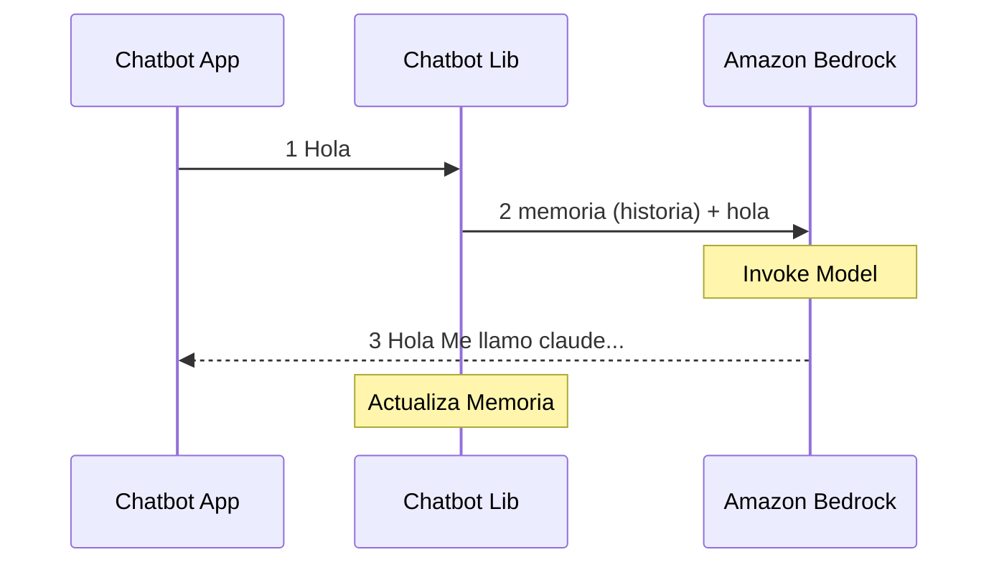
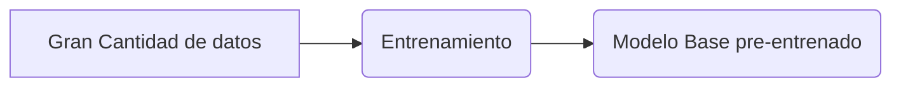
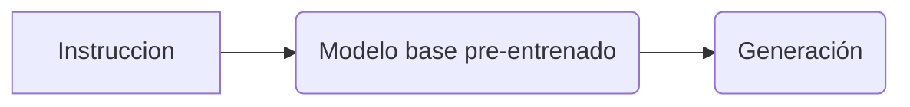

# Asistente Personal con super poderes de Generative AI


1. [Introducción](#introducción)
2. [Pre requisitos](#pre-requisitos)
3. [Lanzar la aplicación de IA Conversacional](#instrucciones-para-lanzar-la-aplicación-ia-conversacional)
4. [Uso del asistente IA Conversacional](#uso-del-asistente-ia-conversacional)
    * [Generación de Código](#generacion-de-código)
    * [Resumen y extracción de informacion](#resumen-y-extracción-de-información-relevante)
    * [Experimenta con few-shot learning](#experimenta-con-few-shot-learning)
4. [Cómo Funciona el chatbot con IA Generativa?](#cómo-funciona-el-chatbot-con-ia-generativa)
4. [Acerca de Modelos Base (Foundation Models)](#modelos-base-foundation-model-o-fm)
5. [Large Language Models (LLMs)](#acerca-del-llm)
    * [Amazon Bedrock y Anthropic Claude](#amazon-bedrock-y-anthropic-claude)
    * [Memoria en un chatbot](#memoria-en-un-chatbot)
    * [Que son los tokens y como se calculan?](#qué-son-y-como-se-estiman-los-tokens)
4. [Costo Estimado](#costo-estimado)
5. [Conclusiones y siguientes pasos](#conclusiones-y-siguientes-pasos)
    * [Posibles siguientes pasos](#posibles-siguientes-pasos)
    * [Recomendaciones para seguir aprendiendo](#recomendacion-para-estudio-adicional)


## Introducción

En este blog (primero de la serie, espero) sobre cómo crear un Asistente Personal usando IA Generativa, 
te compartiré los pasos necesarios para lanzar su propio chatbot en un entorno local y aprovechar esta nueva technología para ayudarte en tus labores diarias forma segura y privada. 

La IA generativa ha revolucionado el mundo porque hemos podido experimentar, a través de aplicaciones de consumidor como ChatGPT, 
lo poderosos que se han vuelto los últimos modelos de aprendizaje automático. 

Si bien se ha prestado mucha atención a cómo los usuarios están usando la IA generativa, hay una oportunidad aún mayor en cómo personas y startups pueden crear aplicaciones basadas en IA Generariva 
y como las empresas los utilizan para mejorar su operación.

Utilizarás [Streamlit](https://docs.streamlit.io/knowledge-base/tutorials) y 
[Langchain](https://python.langchain.com/docs/get_started/introduction) para levantar una aplicación IA 
conversacional simple. 
Verás cómo funciona el código detrás de escenas, y cómo se invocan los modelos de lenguage grandes 
(large language models, LLM) como [Anthropic Claude](https://aws.amazon.com/es/bedrock/claude/)  con [Amazon Bedrock](https://aws.amazon.com/es/bedrock/) y 
para generar respuestas conversacionales. Aprenderemos conceptos como prompts, memoria de conversación y la respuesta en streaming.

Este nuevo asistente nos ayudará a experimentar con distintas tareas como 
generación de código, resumen de textos y [few-shot learning](https://www.promptingguide.ai/techniques/fewshot). 

Nota: Si quieres saber acerca del código que está detrás puedes ir directo a la sección [Cómo funciona](#cómo-funciona).


Manos a la obra!

## Pre requisitos:

Para usar esta aplicación deberas contar con un usuario aws con permisos para usar Bedrock, un perfil local con ese usuario y python3. [Aca puedes encontrar los pre requisitos](prerequisites.md). 
Asegúrate de poder ejecutar  en la aws cli antes de avanzar: 


```zsh
aws bedrock list-foundation-models
``` 

## Instrucciones para lanzar la aplicación IA Conversacional

### Clonar repositorio

Clona este repositorio y accede a la carpeta:

```zsh
git clone https://github.com/ensamblador/generative-ai-chat-application.git
cd generative-ai-chat-application/01-personal-assistant
```

### Configuración del entorno virtual

Esto es un entorno independiente de tu entorno python principal, todo lo que instalas en este entorno `venv` quedará en la carpeta `.venv`

1. Crea un entorno virtual:

    ```zsh
    python3 -m venv .venv
    ```

2. Activa el entorno virtual:

    ```zsh
    source .venv/bin/activate
    ```

### Instalación de dependencias

Instala las dependencias del proyecto:

```zsh
pip install -r requirements.txt
```

### Lanzar la aplicación

Inicia la aplicación del asistente (puedes elegir el puerto con `--server.port`):

```zsh
streamlit run chatbot_app.py --server.port 80
```

La aplicación estará disponible en http://localhost:80

## Uso del asistente IA Conversacional

Ahora tenemos la opción de conversar libremente con la IA. Probemos algunos casos útiles de distintas tareas:


### Generacion de código

```markdown
prompt: necesito un codigo para levantar un chatbot usando streamlit en localhost
```


Nota: si te interesa utilizar esta funcionalidad en tu entorno de desarrollo 
te recomiendo usar [Amazon CodeWhisperer](https://aws.amazon.com/es/codewhisperer/)

### Resumen y extracción de información relevante


```markdown
prompt: Ayudame resumiento en 5 ideas lo siguiente:
< copia un texto largo, por ejemplo: Tiktok Terms of services>
```


Intenta con una pregunta de seguimiento:
```text
prompt: Soy dueño de mis datos?
```

### Experimenta con few-shot learning:

Por ejemplo, el prompt siguiente tiene 1 ejemplo (1-shot):

```markdown

prompt: 
Extract invoice number, total amount and due date (output as json) from the text enclosed by <invoice> tags. Here is an example:
<example> Amazon Web Services, Inc. Invoice Email or talk to us about your AWS account or bill, visit aws.amazon.com/contact-us/ Submit feedback on your Invoice Experience here. Invoice Summary Invoice Number: 1484934918 Invoice Date: November 2 , 2023 TOTAL AMOUNT DUE ON November 2 , 2023 $0.03

{ 
    invoice_number: 1484934918, 
    total_amount: 0.03, 
    due_date: 02/11/2023 
} 

</example>
<invoice> 
Amazon Web Services, Inc. Invoice Email or talk to us about your AWS account or bill, visit aws.amazon.com/contact-us/ Submit feedback on your Invoice Experience here. Invoice Summary Invoice Number: 1401279274 Invoice Date: August 2 , 2023 TOTAL AMOUNT DUE ON August 2 , 2023 $0.03 
</invoice>
```


```markdown
# output:
Here is the JSON extracted from the invoice tags:

{ 
    "invoice_number": 1401279274, 
    "total_amount": 0.03, 
    "due_date": "02/08/2023" 
}
```


## Cómo funciona el chatbot con IA Generativa ?

La aplicacion se construye usando dos script python:

- `chatbot_app.py`: interfaz de usuario donde se usa [streamlit](https://docs.streamlit.io/knowledge-base/tutorials) para la generación de la interfaz HTML (como se ve).
- `chatbot_lib.py`: backend donde invocamos el LLM, principalmente usa [Langchain](https://python.langchain.com/docs/get_started/introduction).

A continuación vemos la secuencia de invocación:

1. El usuario envia un mensaje en cuadro de texto de de streamlit `chatbot_app.py`

    ```python
    input_text = st.chat_input("escribe tu mensaje aquí")
    ```

    `chatbot_app.py` invoca la funcion `get_chat_response()` definida en `chatbot_lib.py` para obtener la respuesta (completación) del input:

    ```python

    chat_message = placeholder.chat_message("assistant") # nuevo contenedor para la respuesta
    
    ...

    with chat_message: 
        chat_response = glib.get_chat_response( # definido en chatbot_lib.py
            prompt=input_text, # texto ingresado por el usuario
            memory=st.session_state.memory, # memoria actual de la conversación
            streaming_callback=st_callback, # funcion a invocar cuando se genere la respuesta progresiva
            model_id= model_id, # id del modelo LLM a invocar
            invocation_kwargs = { # keyworkd args para sobre escribir en la invocación
                "max_tokens_to_sample": max_tokens, # cantidad máxima de tokens generados
                "temperature":temp # temperatura (nivel de libertad o creatividad en la generación)
            }
        )
    ```





2. `chatbot_lib.py` invoca Amazon Bedrock con el `model_id` definido desde la `chatbot_app.py`:

    ```python 
    def get_chat_response(prompt, memory, streaming_callback=None,invocation_kwargs=None, model_id= None):
        
        # Obtenemos una LLM para invocar
        llm = get_llm(streaming_callback, invocation_kwargs, model_id) 
        
        conversation_with_summary = ConversationChain( #cliente chat con memoria
            llm = llm, #instancia de un LLM en Bedrock
            memory = memory, # memoria con resumen
            verbose = True # envia algunos logs a la salida
        )
        # Nuevo template del prompt, a customizar.
        conversation_with_summary.prompt.template ="""The following is a friendly conversation between a human and an AI. 
        The AI is talkative and provides lots of specific details from its context. 
        If the AI does not know the answer to a question, it truthfully says it does not know.

        Current conversation:
        {history}

        Human:{input}

        Assistant:"""
        # retorna la predicción
        # este metodo invoca API de Amazon Bedrock usando Langchain
        return conversation_with_summary.predict(input=prompt) 
    ```

3.  A través de `StreamingCallback` en `chatbot_app.py` la respuesta es procesada a medida que el modelo responde:

    ```python 
    st_callback = StreamlitCallbackHandler(chat_message) # Callback Handler rellena el contenedor con la respuesta
    ```

### Otros componentes

Esto es Opciona: para que el usuario pueda seleccionar desde la UI el model_id, temperatura y max tokens utilizamos componentes de Streamlit:

```python
st.sidebar.markdown('## Parametros')

options = ['anthropic.claude-instant-v1', 'anthropic.claude-v2'] 
model_id = st.sidebar.selectbox('model_id', options) # dropdown para elegir el modelo desde el la app

temp = st.sidebar.slider('Temperatura', 0.0, 1.0, 0.0, 0.01) # slider para temperatura (min, max, default, increment)
max_tokens = st.sidebar.slider('Max Tokens', 50, 10000, 1024, 50) # slider para max tokens
```

Estos parámetros se pasan de acuerdo a las preferencias del usuario al momento de invocar el modelo.


## Modelos Base (Foundation Model o FM)


Los modelos Base (FM por sus siglas en inglés) son modelos de inteligencia 
artificial entrenados con enormes cantidades de ejemplos. Debido a este extenso entrenamiento, 
los FMs desarrollan un profundo conocimiento de los datos y cómo se estructuran.

***Entrenamiento:***



***Uso:***



## Acerca del LLM 

Una subcategoría de FM son Los modelos de lenguaje grandes (LLM por sus siglas en inglés). Son modelos de inteligencia 
artificial entrenados con enormes cantidades de **texto**. Debido a este extenso entrenamiento, 
los LLMs desarrollan un profundo conocimiento del lenguaje y cómo se estructura.

Esto les permite realizar tareas relacionadas con el lenguaje de forma nativa, 
como resumir un texto, extraer información clave de un pasaje, o generar nuevo texto coherente. 
 

### Amazon Bedrock y Anthropic Claude

En este proyecto usas el nuevo servicio de AWS llamado [Amazon Bedrock](https://aws.amazon.com/es/bedrock/)
una forma sencilla de crear aplicaciones de IA Generativa con modelos fundacionales (FMs). 
En este caso usaremos el modelo [Claude de Antrhopic](https://aws.amazon.com/es/bedrock/claude/)


Para invocar el LLM usamos la librería `Bedrock` de `langchain` en (`chatbot_lib.py`)


```python
from langchain.llms.bedrock import Bedrock

model_kwargs = { 
    "max_tokens_to_sample": 1024,  # Maxima cantidad de tokens de salida
    "temperature": 1, # Nivel de creatividad o libertad
    "top_p": 0.9, # top probabilidades a elegir para siguiente token
    "stop_sequences": ["Human:"] # donde se detiene la generacion
}

# Modelo por defecto a utilizar
default_model_id = "anthropic.claude-instant-v1"

def get_llm(streaming_callback=None, invocation_kwargs=None, model_id=None):
    
    # si viene un model_id se usa ese, caso contrario se usa el default
    this_model_id = model_id if model_id else default_model_id 
    bedrock_base_kwargs = dict(model_id=default_model_id, model_kwargs= model_kwargs)
    
    # en el caso de hacer override de invocation_kwargs tales como temperatura y max tokens
    if invocation_kwargs: 
        bedrock_base_kwargs = dict(model_id=this_model_id, model_kwargs= {**model_kwargs, **invocation_kwargs})

    new_kwargs = dict(**bedrock_base_kwargs)

    # la respuesta tiene que ser en streamin?, pasamos streaming_callback al modelo
    if streaming_callback: 
        new_kwargs = dict(**bedrock_base_kwargs, streaming=True,callbacks=[streaming_callback])

    #print("new_kwargs:",new_kwargs)

    llm = Bedrock(**new_kwargs)
    
    #retorna una instancia de llm con Bedrock
    return llm

```


### Memoria en un chatbot

La mayoría de las aplicaciones de IA conversacionales tienen interfaz de chat. 
Un componente clave es poder hacer referencia a información de conversaciones anteriores. 
Esta capacidad de almacenar información de interacciones pasadas se denomina "memoria". 
[LangChain provee herramientas para agregar memoria a un sistema](https://python.langchain.com/docs/modules/memory/).

Principalmente podemos aprovechar las siguientes clases de memoria principales:

- **ConversationBufferMemory**: La más simple, guarda los mensajes de dialogo tal cual. Para cada turno se utiliza el listado de mensajes anteriores como contexto.
- **ConversationBufferWindowMemory**: Como **ConversationBufferMemory** pero solo guarda las ***K*** últimas interacciones.
- **ConversationSummaryMemory**: Lo que hace es crear un resumen de la conversacion hasta el momento para pasar al contexto (en vez de usar todos los mensajes tal cual)
- **ConversationSummaryBufferMemory**: Combina ambos modos: mantiene una cantidad máxima de tokens limites de conversacion (`max_token_limit`), lo más antiguo lo deja como un resumen. Para realizar el resumen necesita un LLM.

En este caso usamos **ConversationSummaryBufferMemory**

`chatbot_lib.py`
```python

def get_memory(): 
    
    # ConversationSummaryBufferMemory requiere un LLM para resumir los mensajes viejos
    # Permite mantener la idea sin extender más alla de limite

    llm = get_llm()
    
    memory = ConversationSummaryBufferMemory(
        llm=llm, max_token_limit=1024,
        human_prefix = "H", ai_prefix= "A" # Prefijos d usuartio y asistente custom para la historia.
    ) 
    return memory

```
`chatbot_app.py`

```python
if 'memory' not in st.session_state: 
    st.session_state.memory = glib.get_memory() #llama a get_memory para inicializarla

```

Luego la instancia de `st.session_state.memory` se pasa como argumento a la conversacion para ir leyendo y escribiendo los diálogos anteriores.


### Qué son y como se estiman los tokens?

Un token es una unidad del texto que el LLM identifica como algo único en indivisible, puede ser una palabra o una parte de ella. 
Como cálculo rápido te puede servir que si tienes 100 tokens puede ser entre 60 y 75 palabras.

Si quieres obtener el número exacto te recomiendo utilizar la librería de `Antropic` para contar los tokens de un texto:

```python
from anthropic import Anthropic
client = Anthropic()
n_tokens = client.count_tokens(texto_a_contar)
```

# Costo estimado

Al utilizar el ambiente local, no incurriremos en gastos asociados a infraestructura de nube. El costo principal viene dado por los LLMs que utilizaremos :


[Fuente](https://aws.amazon.com/es/bedrock/pricing/)
| Modelo | Price for 1000 input tokens |  Price for 1000 output tokens |  
|------------- | :--:|  :-:|
| Claude Instant     | 0.00163     |  0.00551
| Claude V2      | 0.01102      | 0.03268

### Ejemplo 

(la forma de cobro es pago por uso, así que este es un ejercicio)

Imaginemos que nuestra apliación utiliza 500 tokens de entrada cada turno (input + historia) y la respuesta son 500 tokens en promedio, al usarla unas 1000 veces en el mes , nuestros costos totales son 

```calc
500 (tokens entrada) x 1 (mil veces) x  0.00163 (costo por cada mil Tok) = 0,815 USD 
500 (tokens salida ) x 1 (mil veces) x  0.00551 (costo por cada mil Tok) = 2,755 USD
0,815 + 2,755 = 3,57 USD / Mes
```


## Conclusiones y siguientes pasos

La IA generativa ha avanzado mucho y ahora es posible crear aplicaciones útiles sin grandes inversiones de tiempo o dinero. Servicios como Amazon Bedrock facilitan el acceso a modelos de lenguaje gigantes como Claude. 

En esta sesión construiste un chatbot conversacional combinando una interfaz de usuario, lógica de backend y LLMs, y puedes seguir mejorando el asistente personal agregando más capacidades como búsquedas en la web, integraciones con APIs y bases de datos propias. 

Ahora puedes explorar cómo utilizar el asistente para automatizar tareas repetitivas en una empresa u organización.

### Posibles siguientes pasos

Desde acá puedes seguir construyendo:

- Un siguiente paso natural es desplegar el asistente en la nube para escalar su uso (spoiler alert)
- Agregar [documentos o videos y poder chatear sobre ellos](https://python.langchain.com/docs/expression_language/cookbook/retrieval)
- Utilizar [RAG (Retrieval Augmented Generation)](https://python.langchain.com/docs/expression_language/cookbook/retrieval)
- Invocar este tipo de conversaciones con interfaces de Voz


## Recomendacion para estudio adicional

- Si quieres sacar el jugo a los prompts te recomiendo hacer la [guia de prompting](https://www.promptingguide.ai/) (usando tu nuevo asistente) 
- Este excelente [tutorial de Langchain](https://github.com/gkamradt/langchain-tutorials) de @gkamradt
- Si tienes tiempo, este [workshop paso a paso para construir aplicaciones de IA Generativa con Amazon Bedrock y Langchain](https://catalog.workshops.aws/building-with-amazon-bedrock/en-US)

Stay tuned!


