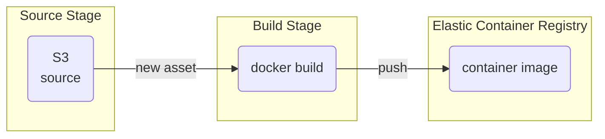
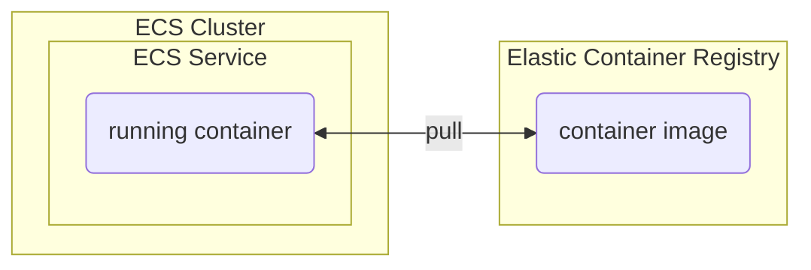
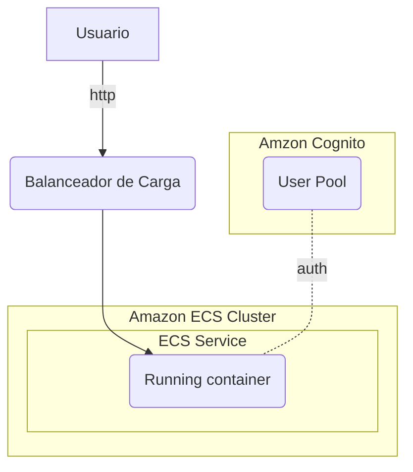

# Despliega tu Asistente de IA Generativa en AWS 


1. [Introducción](#introducción)
2. [Pre requisitos](#pre-requisitos)
3. [Instrucciones para desplegar la Aplicación](#instrucciones-para-desplegar-la-aplicación)
4. [Uso del chatbot con IA generativa](#uso-del-chatbot-con-ia-generativa)
5. [Cómo funciona el despliegue](#cómo-funciona-el-despliegue)
    - [Dockerfile](#dockerfile)
    - [Usando AWS para construir la imagen de contenedor](#usando-aws-para-construir-la-imagen-de-contenedor)
    - [Despliegue del servicio containerizado usando ECS/Fargate](#despliegue-del-servicio-containerizado-usando-ecsfargate)
4. [Costo Estimado](#costo-estimado)
5. [Conclusiones y siguientes pasos](#conclusiones-y-siguientes-pasos)


## Introduccón

En el [blog anterior](/01-personal-assistant/readme.md), aprendiste cómo construir un agente conversacional utilizando modelos de IA generativa de forma local. En este blog continuaremos con el proyecto para llevarlo al siguiente nivel, desplegar la aplicación como un sitio web con autenticación.

Aprenderemos cómo empaquetar nuestra aplicación en un contenedor Docker y desplegarlo en AWS utilizando servicios como en [Elastic Container Service (ECS)](https://aws.amazon.com/es/ecs/). Esto permitirá acceder de forma segura al asistente desde cualquier lugar o dispositivos.

También integraremos autenticación de usuarios utilizando [Amazon Cognito](https://aws.amazon.com/es/cognito/) permitir el acceso sólo a usuarios autenticados. 

Al final de este blog, tendrás un asistente conversacional con IA generativa listo para producción que puede ser accedido por múltiples usuarios simultáneamente desde cualquier dispositivo a través de una interfaz web. 

A construir!

## Pre requisitos

Antes de comenzar, asegúrate de tener instalado lo siguiente:

- [Python 3](https://www.python.org/) y [nodejs / npm](https://nodejs.org/en/download)
- [AWS CLI](https://docs.aws.amazon.com/es_es/cli/latest/userguide/install-cliv2.html).
- CDK (AWS Cloud Development Kit) nos permitirá definir y desplegar la infraestructura de nuestra aplicación de forma declarativa mediante código. [Sigue estas instrucciones para instalarlo](https://docs.aws.amazon.com/cdk/v2/guide/cli.html).

- Cuenta AWS y usuario con permisos: Necesitarás una cuenta AWS y un usuario con los permisos necesarios para crear recursos en servicios como CloudFormation, Secrets Manager, IAM, S3, ECR, etc. Puedes crear un usuario con acceso de administrador temporalmente.

- ***opcional cdk boostrap***: Si este es tu primer proyecto cdk en tu cuenta/region de aws. Deberás ejecutar el comando antes de desplegar el proyecto  👇 

    ```sh
    cdk bootstrap aws://{your_aws_account}/{region}
    ```
    
## Instrucciones para desplegar la Aplicación 

### Clonar repositorio

Clona este repositorio (si es que no lo has hecho)

```zsh
git clone https://github.com/ensamblador/generative-ai-chat-application.git
```

y accede a la carpeta:

```sh
cd generative-ai-chat-application/02-personal-assistant-ecs
```

### Configuración del entorno virtual

```zsh
python3 -m venv .venv
source .venv/bin/activate
```

### Instalación de dependencias

Instala las dependencias del proyecto:

```zsh
pip install -r requirements.txt
```

### Despliegue de recursos 

Ejecuta `cdk deploy` para crear automáticamente los siguientes recursos:


- Un pool de usuarios de Amazon Cognito.
- Repositorio en [Amazon Elastic Container Registry (ECR)](https://aws.amazon.com/es/ecr/) para almacenar la imagen del contenedor.
- Proyecto en[AWS Code Build](https://aws.amazon.com/es/codebuild/) para construir y guardar la imagen del contenedor en ECR
- Un pipeline en [AWS Code Pipeline](https://aws.amazon.com/es/codepipeline/) que toma un zip en S3, y una acción build que dispara el proyecto de Code Build.
- Un cluster de [Amazon Elastic Container Service (ECS)](https://aws.amazon.com/es/ecs/) donde se desplegarán los servicio. Además de una nueva VPC.
- Un Servicio ECS y un balanceador de carga.
- Roles y Permisos necesarios para cada etapa.

luego de unos 6 minutos verás la salida del despliegue terminado:

```sh
✅  PERSONAL-ASSISTANT-ECS

✨  Deployment time: 386.75s

Outputs:
PERSONAL-ASSISTANT-ECS.LappLoadBalancer = PERSON-XXXX.us-east-1.elb.amazonaws.com
PERSONAL-ASSISTANT-ECS.LappServiceURL = http://PERSON-XXXX.us-east-1.elb.amazonaws.com
PERSONAL-ASSISTANT-ECS.UsersAPPCLIENTID = XXXXX
PERSONAL-ASSISTANT-ECS.UsersAPPCLIENTSECRET = XXXXX
PERSONAL-ASSISTANT-ECS.UsersPOOLID = region_XXXX
PERSONAL-ASSISTANT-ECS.Userscognitoconsole = https://region.console.aws.amazon.com/cognito/v2/idp/user-pools/POOLID/users?region=region
```


## Uso del chatbot con IA generativa

#### Para acceder necesitas un usuario
Ingresa a link de los outputs `Userscognitoconsole`, que te lleva a la consola de amazon cognito y crea un usuario nuevo (correo/password). Asegura de hacer check en ***marcar este correo electronico como verificado***


#### Ingresa a la app web
El link de tu aplicación también está en los outputs `LappServiceURL` (http://PERSON-XXXX.us-east-1.elb.amazonaws.com) solo navega ahi y cambia la contraseña:


***Nota:*** Si no sabes donde están estos outputs (url del servicio). Puedes obtenerlos del stack de cloudformation -> Outputs.

---
---

## Cómo funciona el despliegue 

En este caso no veremos en detalle  en cómo funciona el chatbot en términos de IA Generativa, si quieres profundizar te dejo [esta explicación acá](../01-personal-assistant/readme.md#como-funciona-el-chatbot-con-ia-generativa). Ahora nos interesa entender como funciona el despliegue usando servicios de AWS. 

Partamos de lo más básico, el contenedor.

### Dockerfile

Este [Dockerfile](/02-personal-assistant-ecs/streamlit/Dockerfile) tiene las instrucciones para armar el contenedor de la aplicación (utilizando docker). Aquí está una explicación de los comandos:

**`FROM public.ecr.aws/docker/library/python:3.9-slim`** <br/>Establece la imagen base como la imagen oficial de Python 3.9 en [Amazon ECR Public Gallery](https://gallery.ecr.aws/docker/library/python)

**`WORKDIR /app`** <br/>Establece el directorio de trabajo dentro del contenedor en /app.

**`ADD . /app`**<br/>Copia los archivos y directorios del directorio actual en la máquina host al directorio /app dentro del contenedor.

**`RUN pip3 install -r requirements.txt`**<br> Instala las dependencias

**`EXPOSE 8501`**<br/> El puerto de escucha es el 8501

**`ENTRYPOINT ["streamlit", "run", "chatbot_app.py", "--server.port=8501"]`** Esto se ejecuta cuando el contenedor se lanza.


## Usando AWS para construir la imagen de contenedor

Es posible contruir la imagen en nuestro laptop. Necesitamos docker instalado y muchos recursos. Para no depender de los recursos locales vamos a usar un pipeline de construcción y publicación de la imagen.



Detalle:

- Source S3 es una acción que se gatilla cuando aparece una nueva versión del archivo en una ubicación de s3 (ejemplo s3://path/to/file/asset.zip)
- Build Stage es un proyecto de AWS Code Build, que se inicia activado por Source Stage. Las instrucciones de ese proyecto Code Build están definidas en [buildspec.yml](/02-personal-assistant-ecs/streamlit/buildspec.yml). Principalmente `docker build` y `docker push`. La imagen de contenedor se almacena en Amazon ECR.


## Despliegue del servicio containerizado usando ECS/Fargate

Una vez está la imagen publicada en ECR, se despliega en Amazon [Elastic Container Service (ECS)](https://aws.amazon.com/es/ecs/) con tecnología [Fargate](https://docs.aws.amazon.com/AmazonECS/latest/userguide/what-is-fargate.html), de esta forma no tenemos que ocuparnos de desplegar y administrar servidores.

Adicional el servicio ECS, desplegaste un balanceador de carga que enruta las peticiones de los usuarios  a las tareas del servicio que corren en el cluster ECS.


### Despliegue




### Uso 




## Autenticación

Como sabemos, usamos [Amazon Cognito](https://aws.amazon.com/es/cognito/) como proveedor de identidades (usuario y contraseña). Pero como sabe la aplicación [chatbot_app.py](/02-personal-assistant-ecs/streamlit/chatbot_app.py) eso? Hicimos un pequeño cambio respecto al proyecto pasado:

```python
#importamos esta nueva librería
from streamlit_cognito_auth import CognitoAuthenticator

#Variables de entorno tienen los datos
pool_id = os.environ.get("POOL_ID")
app_client_id = os.environ.get("APP_CLIENT_ID")
app_client_secret = os.environ.get("APP_CLIENT_SECRET")

#Esta clase nos permite interactuar con cognito, 
# presenta la UI y hace las llamadas de API
authenticator = CognitoAuthenticator(
    pool_id=pool_id,
    app_client_secret=app_client_secret,
    app_client_id=app_client_id,
)

is_logged_in = authenticator.login()

```

En el proyecto cdk, le pasamos al contenedor estas variables de entorno (`POOL_ID`,`APP_CLIENT_ID`, `APP_CLIENT_SECRET` ) luego de crear los recursos de cognito:

[`personal_assistant_ecs_stack.py`](/02-personal-assistant-ecs/personal_assistant_ecs/personal_assistant_ecs_stack.py)
```python
def create_user_pool(self):
    self.users = UserPool(self, "Users")
    self.task_environment = {
        "POOL_ID": self.users.pool_id,
        "APP_CLIENT_ID": self.users.app_client_id,
        "APP_CLIENT_SECRET": self.users.app_client_secret
    }
```

De esta forma el contenedor puede acceder a ellas en tiempo de ejecución.

## Costo estimado

Adicional a los costos de LLM indicados en el [proyecto anterior](../01-personal-assistant/readme.md#costo-estimado) debemos agregar los servicios e infraestructura de nube:


- Balanceador de Carga ([pricing](https://aws.amazon.com/es/elasticloadbalancing/pricing/)): 
    ```
    0,0225 + 0,008 USD x hora. Aproximadamente 22 USD x Mes
    ```
    ***Nota*** Si aún estás en el [free tier](https://aws.amazon.com/es/free/) de 12 meses: 0 USD x Mes

    (esta cantidad soporta hasta 3000 conexiones activas por minuto)

- Servicio Fargate (ARM): 
    ```
    0,50 CPU virtuales x 720 horas x 0,03238 USD por hora = 11,66 USD por las horas de vCPU
    1,00 GB x 720 horas x 0,00356 USD por GB por hora = 2,56 USD por las horas de GB

    Aproximadamente 15 USD x Mes
    ```
Para saber cuantas tareas necesitamos ejecutar en paralelo para soportar la demanda de usuarios, te sugiero [probar un test de carga](https://ecsworkshop.com/monitoring/container_insights/performloadtest/). Este valor viene dado más por los recursos de la app (CPU, RAM) necesarios para cada usuario. 

- [Amazon Cognito](https://aws.amazon.com/es/cognito/pricing/): Free Tier, siempre que estés bajo los 50.000 Usuarios activos mensuales.
- Otros costos pequeños: [ECR](https://aws.amazon.com/es/ecr/pricing/), [Code build](https://aws.amazon.com/es/codebuild/pricing/), [Code Pipeline](https://aws.amazon.com/es/codepipeline/pricing/).

En este caso si deseas destruir los recursos para no incurrir en gastos puedes ejecutar

```sh
cdk destroy
```

(o ir a la consola de cloudformation y eliminar el stack)


## Conclusiones y siguientes pasos

En esta oportunidad aprendiste a empaquetar una aplicación Python en un contenedor Docker para facilitar su despliegue. Entre otras cosas:

- Utilizamos servicios de AWS como CodeBuild y CodePipeline para automatizar la construcción y publicación de la imagen de contenedor en ECR.
- Desplegamos el contenedor en ECS Fargate para ejecutarlo de forma escalable y serverless.
- Integramos autenticación de usuarios con Amazon Cognito para permitir el acceso solo a usuarios registrados.


Algunas ideas como siguientes pasos:
- Agregar el CI / CD. Permitir la integración y despliegue continuo de nuevas versiones.
- Permitir que los usuarios subir sus propios datos para personalizar las respuestas.


¿Qué te parece? Déjame saber si tienes alguna otra idea para agregar a las conclusiones o siguientes pasos. Estoy aquí para ayudarte a completar esta sección del blog.