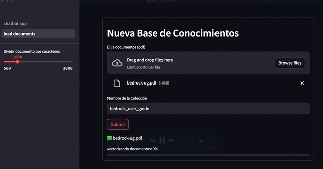
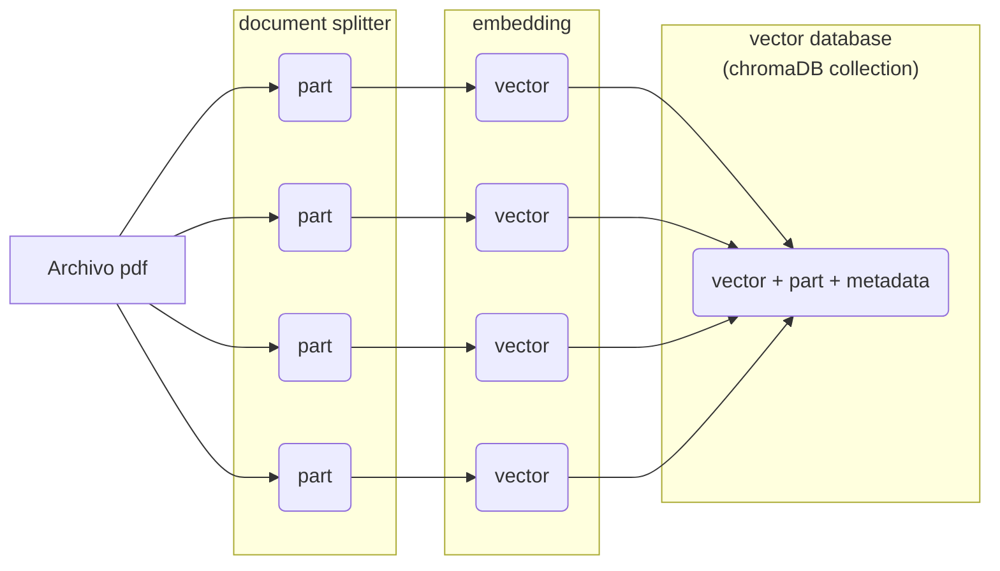
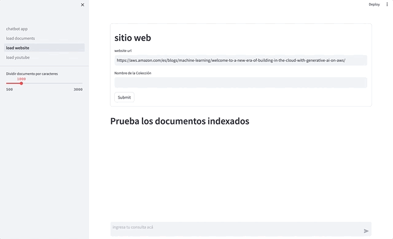
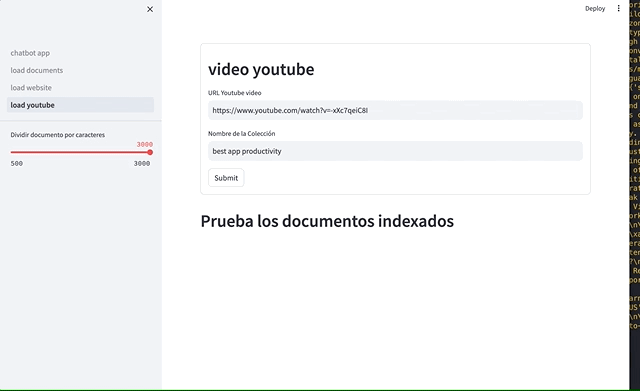
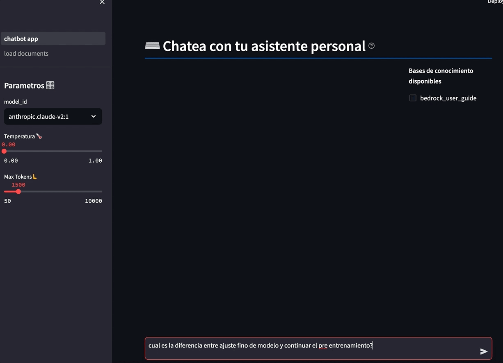
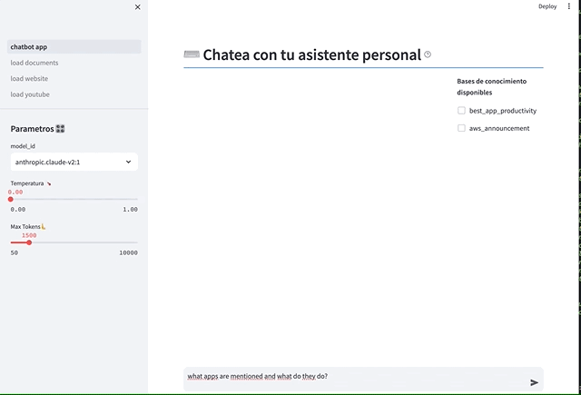
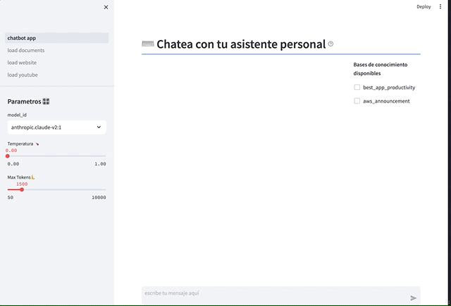
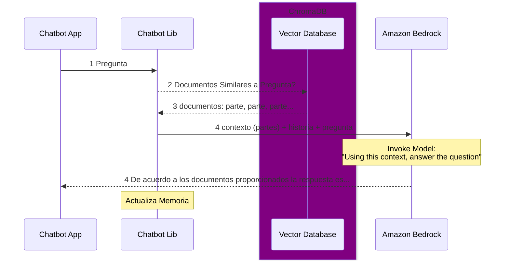

# Agrega y consulta documentos a tu Asistente de IA Generativa


1. [Introducción](#introducción)
2. [Pre requisitos](#pre-requisitos)
3. [Lanzar la aplicación de IA Conversacional](#instrucciones-para-lanzar-la-aplicación-ia-conversacional)
4. [Flujo de procesamiento de documentos](#flujo-de-carga-de-documentos)
    * [Documentos PDF](#documentos-pdf)
    * [Sitios Web](#carga-de-sitios-webs)
    * [Transcripciones de Youtube](#carga-de-transcripciones-de-videos-youtube)
4. [Uso de los documentos en la consulta](#uso-de-los-documentos-en-la-consulta)
4. [Secuencia de Ejecución de RAG](#secuencia-de-ejecución-de-rag)
5. [Conclusiones y siguientes pasos](#conclusiones-y-siguientes-pasos)


# Introducción

Desde manuales de usuario, reportes técnicos e informes de investigación, hasta contratos legales y transcripciones de llamadas, las empresas acumulan una enorme cantidad de contenido en formato de texto no estructurado. Procesar y extraer conocimiento útil de estos documentos suele ser una tarea tediosa y propensa a errores cuando se hace manualmente. Además, encontrar y recuperar información específica entre cientos o miles de documentos puede ser como buscar una aguja en un pajar.

En este artículo, complementarás el asistente de IA conversacional para ayudar a resolver estos desafíos. Utilizando técnicas de búsqueda semática en documentos utilizando modelos embeddings como [Amazon Titan](https://aws.amazon.com/es/bedrock/titan/) como  y procesamiento con LLM como [Anthropic Claude](https://aws.amazon.com/es/bedrock/claude/) en [Amazon Bedrock](https://aws.amazon.com/es/bedrock/).


Nota: Si quieres saber acerca del código que está detrás puedes ir directo a [Cómo funciona](#como-funciona-el-chatbot-con-ia-generativa).

Manos a la obra!

## Pre requisitos:

Para usar esta aplicación deberas contar con un usuario aws con permisos para usar Bedrock, un perfil local con ese usuario y python3. [Aca puedes encontrar los pre requisitos](../01-personal-assistant/prerequisites.md). 
Asegúrate de poder ejecutar en la aws cli antes de avanzar: 


```zsh
aws bedrock list-foundation-models
``` 

# Instrucciones para lanzar la aplicación IA Conversacional 

## Clonar repositorio

Clona este repositorio y accede a la carpeta:

```zsh
git clone https://github.com/ensamblador/generative-ai-chat-application.git
cd generative-ai-chat-application/03-personal-assistant-add-data
```

## Configuración del entorno virtual

Esto es un entorno independiente de tu entorno python principal, todo lo que instalas en este entorno `venv` quedará en la carpeta `.venv`

Crea y activa  entorno virtual con sus dependencias:

```zsh
python3 -m venv .venv
source .venv/bin/activate
pip install -r requirements.txt
```


## Lanzar la aplicación

Inicia la aplicación del asistente (puedes elegir el puerto con `--server.port`):

```zsh
streamlit run chatbot_app.py --server.port 80
```

La aplicación estará disponible en http://localhost:80


# Flujo de carga de documentos 

En este proyecto puedes incorporar tres tipos de documentos: pdf, transcripciones de youtube y sitios web. Puede revisar una lista extensiva de [loaders acá](https://python.langchain.com/docs/integrations/document_loaders).


## Documentos pdf

Cuando carga la aplicación veremos un nuevo menú lateral `load documents`. Ahi podemos seleccionar un archivo pdf cualquiera y cargamos, escribimos un nombre para la colección y le damos al botón **Submit**



_Nota: el gif está acelerado, tomó aproximadamente 5 minutos procesar el archivo._

El procesamiento de los documentos para ser utilizados por el asistente se realiza de la siguiente manera

1. El usuario carga archivos PDF a través de un componente File Loader de Streamlit


[`pages/load_documents.py`](./pages/load_documents.py)
```python
uploaded_files = st.file_uploader("Elija documentos (pdf)", accept_multiple_files=True)
```

2. Los PDFs se cargan con [`PyPDFLoader`](https://python.langchain.com/docs/modules/data_connection/document_loaders/pdf) y se procesan para dividirlos en pasajes individuales

Es decir, obtenermos un documento dividido por `splitby` caracteres (definidos en los parámetros de side bar), con un overlap de 10% aproximadamente.

[`vdb_lib.py`](vdb_lib.py)
```python
def load_and_split_pdf(file_path, splitby):

    text_splitter = RecursiveCharacterTextSplitter(
        separators=["\n\n", "\n", "\. ", " ", ""],
        chunk_size=splitby,
        chunk_overlap=int(splitby/10),
        length_function=len
    )

    loader = PyPDFLoader(file_path)
    docs = loader.load_and_split(text_splitter)
    return docs
```

3. Cada una de las partes se procesan por un modelo que convierte texto a vectores, llamados embeddings, lo cual permite calcular distancia entre un texto de otro.

Para la base de vectores utilizamos [ChromaDB](https://www.trychroma.com/) dado que nos brinda la posibilidad de guardar nuestra base de datos de forma local. Te invito a revisar otras opciones que se pueden integrar como un [vector database en langchain](https://python.langchain.com/docs/integrations/vectorstores/).

Para el uso en la aplicación creamos una clase de python que se encarga de inicializar, crear, almacenar y devolver las bases vectores.

```python 

bedrock_embeddings = BedrockEmbeddings(model_id="amazon.titan-embed-text-v1")


class CustomChromaClass():
    def __init__(self) -> None:
        if is_local: chroma_path = f"{user_name}/chroma"
        else: chroma_path = f"{volume}/{user_name}/chroma"
        # chroma (lowercase) client
        self.persistent_client = chromadb.PersistentClient(path=chroma_path)
        collections = self.persistent_client.list_collections()
        self.vectordbs = {}

        for collection in collections:
            langchain_chroma = Chroma(
                client=self.persistent_client,
                collection_name=collection.name, 
                embedding_function=bedrock_embeddings
            )
            print(collection.name,":",langchain_chroma._collection.count())
            self.vectordbs[collection.name] = langchain_chroma
        self.vectordb = False

    def create_vectordb(self, name):
        name =  clean_name(name)
        # Chroma (capital C) is langchain chroma wrapper
        vectordb = Chroma(
            client=self.persistent_client,
            embedding_function = bedrock_embeddings,
            collection_name=name
        )
        self.vectordbs[name] = vectordb
        self.vectordb = vectordb
        return vectordb
    
    def get_vectordb(self, name):
        return self.vectordbs[name]

    def add_docs(self, collection_name, docs, n=10):
        add_docs_by_chunks(self.vectordbs[collection_name], docs, n)

```
En el siguiente diagrama se muestra el proceso completo.



## Carga de sitios webs 

Como ven, podemos utilizar el mismo concepto para cargar un sitio web completo. Ahora utilizamos [`WebBaseLoader`](https://python.langchain.com/docs/integrations/document_loaders/web_base) (basado en [Beautiful Soup](https://pypi.org/project/beautifulsoup4/)  y [Requests](https://pypi.org/project/requests/)) para cargar todo el texto útil de un sitio web en una base de vectores.

```python
from langchain.document_loaders import WebBaseLoader
...
loader = WebBaseLoader(url)
```




## Carga de transcripciones de videos Youtube

Para cargar un video de youtube, tenemos que extraer la transcripción . Ahora utilizamos [`YoutubeLoader`](https://python.langchain.com/docs/integrations/document_loaders/youtube_transcript) que utiliza [youtube-transcript-api](https://pypi.org/project/youtube-transcript-api/) para obtener las transcripciones o subtítulos existentes de un video de Youtube.

```python
from langchain.document_loaders import YoutubeLoader
...
loader = YoutubeLoader.from_youtube_url(video_url, add_video_info=True )
```




## Uso de los documentos en la consulta

Para consultar la base de datos vectorial, la aplicación busca pasajes similares al texto ingresado como consulta, utilizando la similitud entre embeddings. Luego utiliza estas partes como contexto para reponder. Esta técnica es conocida como [Retrieval Augmented Generation](https://python.langchain.com/docs/use_cases/question_answering/). Problemos algunas consultas:

de [Bedrock User Guide](https://docs.aws.amazon.com/pdfs/bedrock/latest/userguide/bedrock-ug.pdf#what-is-bedrock):

(asegura de hacer click en alguna base de conocimiento disponible que hayas cargado)

___Input: cual es la diferencia entre ajuste fino de modelo y continuar el pre entrenamiento?___



La aplicación se encarga de manejar la conexión a ChromaDB, ejecutar las consultas y retornar los resultados en texto para que el LLM genere la respuesta. Incluso podemos hacer preguntas de clarificación, gracias a la memoria que posee nuestro asistente:

___Input: explícamelo mejor, como una analogía de la vida real___


Podemos consultar otras bases creadas, por ejemplo la transcripción del video Youtube cargado (best apps for productivity):

___Input: what apps are mentioned and what do they do?___





Veamos que nos puede decir del blog que agregamos 

de: [Welcome to a New Era of Building in the Cloud with Generative AI on AWS](https://aws.amazon.com/es/blogs/machine-learning/welcome-to-a-new-era-of-building-in-the-cloud-with-generative-ai-on-aws/)

___Input: what whas announced around generative ai?___




Además se pueden combinar varias collections en una sola pregunta. Intentalo.


## Secuencia de ejecución de RAG

A continuación vemos la secuencia cuando utilizamos [RAG](https://python.langchain.com/docs/use_cases/question_answering/) en nuestra pregunta.





El wrapper de chroma en langchain nos permite utilizar la base de vectores como un retriever, como vemos en  [`vdb_lib.py`](vdb_lib.py)

```python
def get_retriever(name):
     if 'chroma_client' in st.session_state:
        vector_db = st.session_state.chroma_client.vectordbs[name]
        return vector_db.as_retriever(search_type = "mmr",  search_kwargs={"k": 10})
```
_Nota: el retriever utiliza [mmr (relevancia maxima margina)](https://python.langchain.com/docs/integrations/vectorstores/chroma#retriever-options) una forma de decir que no queremos documentos muy similares o repetidos._

Finalmente, utilizamos **`ConversationalRetrievalChain`** de Lanchain para procesar todo: el retriever, la memoria y la historia dentro de la conversación. 

En [`chatbot_lib.py`](chatbot_lib.py) se invocará `ConversationalRetrievalChain` `ConversationChain` dependiendo si vamos a usar o no alguna colección de chroma.

```python
def get_chat_rag_response(prompt, retriever, memory, streaming_callback=None, invocation_kwargs=None, model_id= None):
    
    llm = get_llm(streaming_callback, invocation_kwargs, model_id) 
    qa = ConversationalRetrievalChain.from_llm(
        llm,
        verbose=True,
        retriever=retriever,
        memory=memory,
        get_chat_history=lambda h : h # workaround dado que utilizamos la misma memoria para RetrievalChain y ConversationChain
    ) 
    return qa.run({"question": prompt})
```


## Conclusiones y siguientes pasos


En esta sesión, tomamos el Asistente de IA generativo y lo supercargamos con búsqueda semántica y RAG para responder preguntas encontrando pasajes relevantes en los documentos. A partir de aquí, puedes seguir construyendo sobre esta base de muchas maneras:

- Agregar capacidades [resumen de documentos](https://python.langchain.com/docs/use_cases/summarization) al momento de la carga. 
- Usar [nuevos loaders](https://python.langchain.com/docs/integrations/document_loaders)
- Experimentar diferentes tamaños de splitters y embeddings como [Cohere Embed-Multilingual](https://aws.amazon.com/es/bedrock/cohere-command/)
- Experimentar con [Self-Query](https://python.langchain.com/docs/modules/data_connection/retrievers/self_query/)
- Mul


## Recomendacion para estudio adicional

- Como siempre, si quieres sacar el jugo a los prompts te recomiendo hacer la [guia de prompting](https://www.promptingguide.ai/) (usando tu nuevo asistente) 
- Este excelente [tutorial de Langchain](https://github.com/gkamradt/langchain-tutorials) de @gkamradt 
- Si tienes tiempo, este [workshop paso a paso para construir aplicaciones de IA Generativa con Amazon Bedrock y Langchain](https://catalog.workshops.aws/building-with-amazon-bedrock/en-US)

Stay tuned!


